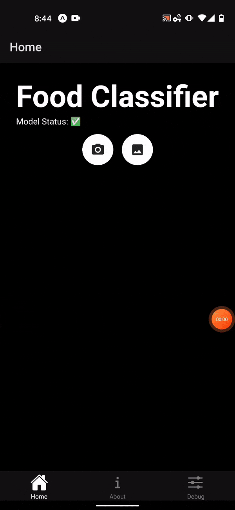

## Overview 

Analogous to the web app the same TensorFlow.js converted model will be used but now deployed as a mobile app. The output will be a mobile app that can be viewed on a simulator or your smartphone.

The following lines illustrate how to use tensorflow.js with react native. 

## Demo 

Here is the app in action.




## Setup

### 1. Set up the environment
The first step is to install the dependencies [yarn](https://classic.yarnpkg.com/en/docs/install#windows-stable) and [expo](https://expo.dev/).

- Expo is a free and open-source toolchain built around React Native to help you build cross-platform native iOS and Android projects using JavaScript and React.
- To develop locally, you will need to install JavaScript tools.
- JavaScript packages like Expo are installed through yarn.
- The JavaScript environment that is commonly used for building apps is [Node](https://nodejs.org/en/).
- To develop locally, you will need Node and Expo installed.

a. Install Node
Install the latest stable version of [Node](https://nodejs.org/en/).

b. Install yarn
Install the latest stable version of [yarn](https://classic.yarnpkg.com/en/docs/install#windows-stable).

c. Install Expo
It can be installed with the command below:
```
yarn global add expo-cli
```
d. Expo set-up (mobile)
- Download the Expo Android or iOS app from the respective mobile stores.
- Login to the Expo app.

e. Expo set-up (computer)
Login to expo on your computer.
```
expo login
```

### 2. Set up the repo

- Using the following [template](https://github.com/reshamas/deploying-mobile-app) repository, take the converted TensorFlow.js files and copy them to this folder in the template mobile app repo using this directory structure. The classes.json file should also be included in this directory.
```
(base) deploying-mobile-app % tree assets/model_tfjs 
assets/model_tfjs
├── classes.json
├── classes.txt
├── group1-shard1of1.bin
└── model.json
```

### 3. Get the mobile app running 

a. Install project dependencies
```
yarn
```

b. Start the app
```
yarn run start
```
- Open the Expo app on your phone.
- You will see your project listed under "Recently in Development". Select it.
- In the mobile app at the top, you will see "Model Loaded". Once a green checkmark appears, you are ready to test an image.
- You can test an image from your camera roll or take a picture of a new image. After you select an image, your screen will display the prediction and inference timing.

